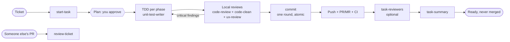

# The ticket-to-merge workflow

The assets are designed to chain, but each also works alone.

`/execute-task` runs the whole chain. `/start-task` and `/review-ticket` run their part alone.

## Who does what

| Stage | Asset | Writes? |
|---|---|---|
| Set up branch, baseline tests, draft PR | `start-task` | branch, draft PR/MR |
| Write the failing test first | `unit-test-writer` | specs |
| Correctness, security, performance, design | `code-review` | no (read-only) |
| Clean Code gate, metrics, dead code | `code-clean` | no (read-only) |
| UX and accessibility on frontend changes | `ux-review` | no (read-only) |
| Commit message and staging | `commit` | commits, only after confirmation |
| Balanced tester proposal and assignment | `task-reviewers` | ticket tester field, PR/MR reviewers, only after `confirmed=true` |
| Material to explain the task out loud | `task-summary` | one docs page |
| Review a finished ticket and PR | `review-ticket` | optional comments only |

## Design rules shared by all of them

- **Gates and evidence.** A step is complete only with pasted real output. A review whose agent could not read the ticket or the diff does not count as "no findings".
- **Reviews before commits.** They run on the local working tree before the first commit or push, in as many passes as needed, so history stays clean. The local diff is never empty; an empty diff stops the review.
- **Pauses are end of turn.** Where a decision is yours (plan, commit plan, testers), the assistant stops and waits for `go` or `changes: ...`.
- **Read-only reviewers, no merges.** Nothing merges the PR/MR. Only you or your pipeline do.
- **Single sources of truth.** Commit format lives in `commit`; testing instructions are written once and published identically on the PR/MR and the ticket.
- **Degrade, do not guess.** If a tool is unavailable, the step falls back to manual instructions or a markdown file and says so.

## Using only parts of it

- Only reviews: install `devflow-review` and run `/review-ticket`.
- Only commits: install the `commit` skill.
- No tracker: set `tracker.type: none`; the flow works from branch names and free text.
- No GitHub/GitLab CLI: provide an MCP server and extend the agents' `tools:` line (see `examples/jira-gitlab/`).
