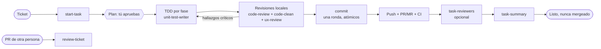

# El flujo ticket-a-merge

Los assets están pensados para encadenarse, pero cada uno funciona solo.

`/execute-task` corre toda la cadena. `/start-task` y `/review-ticket` corren su parte por separado.

## Quién hace qué

| Etapa | Asset | ¿Escribe? |
|---|---|---|
| Preparar rama, tests base, PR en borrador | `start-task` | rama, PR/MR en borrador |
| Escribir primero el test que falla | `unit-test-writer` | specs |
| Correctitud, seguridad, performance, diseño | `code-review` | no (solo lectura) |
| Gate de Clean Code, métricas, código muerto | `code-clean` | no (solo lectura) |
| UX y accesibilidad en cambios de frontend | `ux-review` | no (solo lectura) |
| Mensaje de commit y staging | `commit` | commits, solo tras confirmación |
| Propuesta y asignación balanceada de testers | `task-reviewers` | campo tester del ticket, reviewers del PR/MR, solo con `confirmed=true` |
| Material para explicar la tarea en voz alta | `task-summary` | una página de docs |
| Revisar un ticket y PR terminados | `review-ticket` | solo comentarios opcionales |

## Reglas de diseño compartidas

- **Gates y evidencia.** Un paso está completo solo con salida real pegada. Una revisión cuyo agente no pudo leer el ticket o el diff no cuenta como "sin hallazgos".
- **Revisiones antes de commits.** Corren sobre el working tree local antes del primer commit o push, en las pasadas que hagan falta, para que el historial quede limpio. El diff local nunca está vacío; un diff vacío detiene la revisión.
- **Las pausas son fin de turno.** Donde la decisión es tuya (plan, plan de commits, testers), el asistente se detiene y espera `go` o `changes: ...`.
- **Revisores de solo lectura, sin merges.** Nada hace merge del PR/MR. Solo tú o tu pipeline.
- **Fuentes únicas de verdad.** El formato de commit vive en `commit`; las instrucciones de testeo se escriben una vez y se publican igual en el PR/MR y el ticket.
- **Degradar, no adivinar.** Si una herramienta no está disponible, el paso cae a instrucciones manuales o a un archivo markdown y lo dice.

## Usar solo una parte

- Solo revisiones: instala `devflow-review` y ejecuta `/review-ticket`.
- Solo commits: instala el skill `commit`.
- Sin tracker: `tracker.type: none`; el flujo trabaja con nombres de rama y texto libre.
- Sin CLI de GitHub/GitLab: aporta un servidor MCP y extiende la línea `tools:` de los agentes (ver `examples/jira-gitlab/`).
